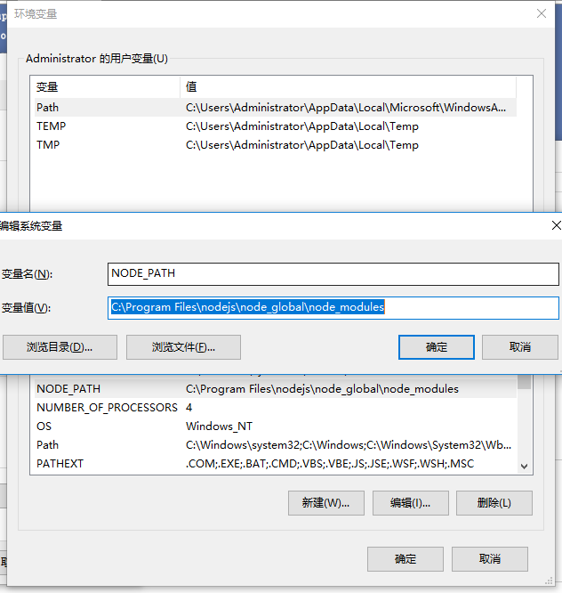
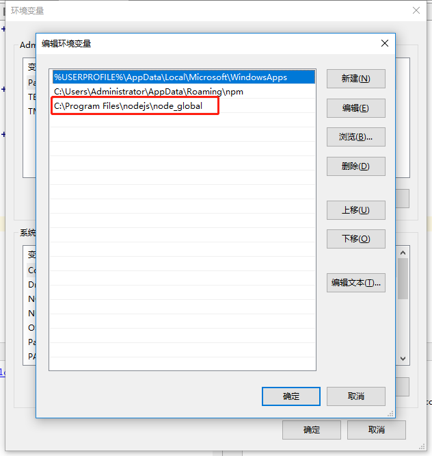

### Node环境变量配置
+ 安装nodeJs，默认安装位置在C:\Program Files文件夹下
+ 我的电脑-右键-属性-高级系统设置-高级-环境变量
+ 在【系统变量】下新建【NODE_PATH】，输入【C:\Program Files\nodejs\node_modules】

+ 在【用户变量】下的【Path】修改为【C:\Program Files\nodejs\node_global】

### Npm使用    
+ 切换淘宝镜像源
    + 临时：npm --registry https://registry.npm.taobao.org
    + 永久：npm i -g cnpm --registry=https://registry.npm.taobao.org
    + 验证方式：npm config get registry 
+ 使用教程：
    + [npm scripts 使用指南](http://www.ruanyifeng.com/blog/2016/10/npm_scripts.html "npm scripts 使用指南 -- 阮一峰")

+ https://nodejs.jakeyu.top/
