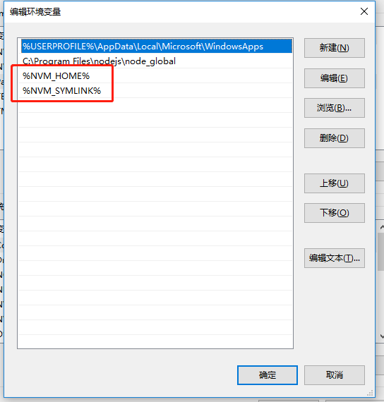
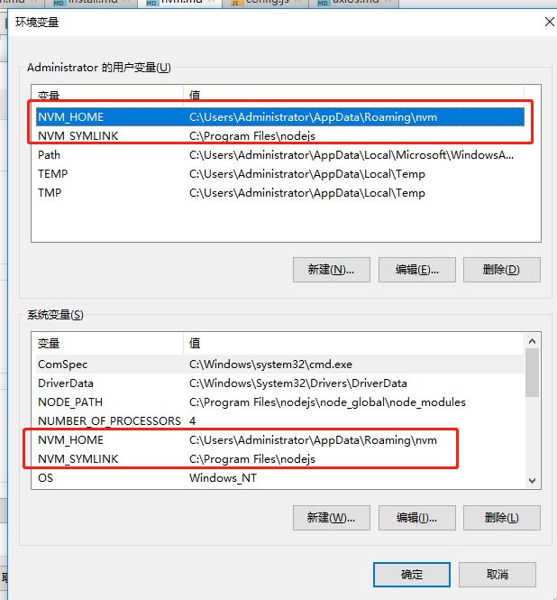

### Nvm使用说明
nvm用于用户管理和控制多个nodeJs的版本

+ Nvm命令
```
# 列出所有可以安装的node版本号
nvm ls-remote

#列出所有已经安装的node版本
nvm ls

#安装指定版本号的node
nvm install v10.3.0

#卸载指定版本号的node
nvm uninstall v10.3.0

#切换node的版本，这个是全局的
nvm use v10.3.0

#当前node版本
nvm current
```
::: tip Tips
 + 安装前先删除已经安装在电脑上的nodeJs。
 + 切换指定版本后，要用nvm on启用nvm。
 + 如果出现安装的时候过慢，node或npm包下载不下来，可以找到nvm包下的setting文件,指定下载地址为淘宝镜像。
 ```
 root: C:\Users\Administrator\AppData\Roaming\nvm
 path: C:\Program Files\nodejs
 node_mirror: https://npm.taobao.org/mirrors/node/
 npm_mirror: https://npm.taobao.org/mirrors/npm/
 ```
:::

### nvm环境变量配置
+ 【用户变量】下的【Path】
<br/>

+ 【系统变量】
<br/>

