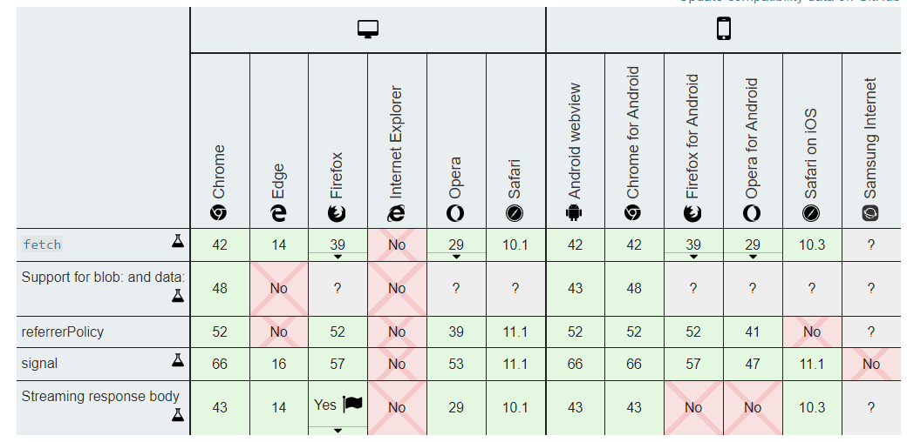

## 兼容性


## fetch常用配置项
+ method: 请求使用的方法，如 GET、POST。
+ headers: 请求的头信息。
+ body: 请求的 body 信息。
::: tip 
 GET 或 HEAD 方法的请求不能包含 body 信息。
::: 
+ mode: 请求的模式。
::: tip 
cors、 no-cors 或者 same-origin
::: 
+ credentials: 请求的 credentials。
::: tip
+ omit、same-origin 或者 include
+ 为了在当前域名内自动发送 cookie ， 必须提供这个选项
:::
+ cache:  请求的 cache 模式。
::: tip
default 、 no-store 、 reload 、 no-cache 、 force-cache 或者 only-if-cached
:::
+ redirect: 可用的 redirect 模式。
::: tip
+ follow (自动重定向)
+ error (如果产生重定向将自动终止并且抛出一个错误)
+ manual (手动处理重定向) 
:::
+ referrer: 一个 USVString。
::: tip
+ no-referrer、client或一个 URL。
+ 默认是 client。
:::
+ referrerPolicy: 指定了HTTP头部referer字段的值。

## fetch配置化
```
import store from './store'
import router from './router'

function toUnderline (key) {
  return key.replace(/([A-Z])/g, '_$1').toLowerCase();
}

function toQueryString (obj) {
  if (obj === null) {
    return ''
  }
  if (typeof obj === 'function') {
    return toQueryString(obj())
  }
  let kv = []
  for (let key of Object.keys(obj)) {
    let val = obj[key]
    if (val instanceof Array) {
      for (let v of val) {
        kv.push(encodeURIComponent(toUnderline(key)) + '[]=' + encodeURIComponent(valueOf(v)))
      }
    } else {
      kv.push(encodeURIComponent(toUnderline(key)) + '=' + encodeURIComponent(valueOf(val)))
    }
  }
  return kv.join('&')
}

function valueOf (obj) {
  if (obj === null || typeof obj === 'undefined') {
    return ''
  }
  if (typeof obj === 'function') {
    return valueOf(obj())
  }
  return obj.toString()
}

function handleActionDenied () {
  router.push('Login')
}

function handleServerError (statusText) {
  console.warn('Request Error due to ' + (statusText || 'Server Error'))
}

function handleUnsupported (statusText) {
  console.warn('Request Error' + (statusText ? ' due to ' + statusText : '') + '.')
}

function error (status, statusText, response) {
  if (status <= 199) {
    console.info(statusText)
  } else if (status >= 200 && status <= 299) {
    console.info(statusText)
  } else if (status >= 300 && status <= 399) {
    if (typeof response === 'string') {
      location.href = response
    } else if (response && response.redirect_url) {
      location.href = response.redirect_url
    } else {
      location.href = '/'
    }
  } else if (status >= 400 && status <= 499) {
    switch (status) {
      case 401:
        location.href = store.state.path.loginPage + '?redirect=' + encodeURIComponent(location.href)
        break;
      case 403:
        handleActionDenied(statusText)
        break;
      default:
        let e = new Error(statusText)
        e.response = response
        throw e
    }
  } else if (status >= 500 && status <= 599) {
    handleServerError(statusText)
  } else {
    handleUnsupported(statusText)
  }
}

function getJson (url, params, complete) {
  let queryString = toQueryString(params)
  if (queryString.length > 0) {
    url = url + (url.indexOf('?') > 0 ? '' : '?') + queryString
  }

  let options = {
    method: 'GET',
    cache: 'no-cache',
    mode: store.state.cors ? 'cors' : 'same-origin',
    credentials: store.state.cors ? 'include' : 'same-origin',
    headers: {
      'Authorization': store.state.authorization,
      'Accept': 'application/json'
    }
  }

  return _fetchJson(url, options, complete)
}

function get (url, params, complete) {
  let queryString = toQueryString(params)
  if (queryString.length > 0) {
    url = url + (url.indexOf('?') > 0 ? '' : '?') + queryString
  }

  let options = {
    method: 'GET',
    cache: 'no-cache',
    mode: store.state.cors ? 'cors' : 'same-origin',
    credentials: store.state.cors ? 'include' : 'same-origin',
    headers: {
      'Authorization': store.state.authorization
    }
  }

  return _fetch(url, options, complete)
}

function postJson (url, params, complete, useCache) {
  params = params || {}

  let data = new FormData()
  for (let key of Object.keys(params)) {
    data.append(key, params[key])
  }

  let options = {
    method: 'POST',
    cache: 'no-cache',
    mode: store.state.cors ? 'cors' : 'same-origin',
    credentials: store.state.cors ? 'include' : 'same-origin',
    headers: {
      'Content-Type': 'application/x-www-form-urlencoded',
      'Authorization': store.state.authorization,
      'Accept': 'application/json'
    },
    body: toQueryString(params)
  }

  return _fetchJson(url, options, complete, useCache !== false)
}

function post (url, params, complete, useCache) {
  params = params || {}

  let data = new FormData()
  for (let key of Object.keys(params)) {
    data.append(key, params[key])
  }

  let options = {
    method: 'POST',
    cache: 'no-cache',
    mode: store.state.cors ? 'cors' : 'same-origin',
    credentials: store.state.cors ? 'include' : 'same-origin',
    headers: {
      'Content-Type': 'application/x-www-form-urlencoded',
      'Authorization': store.state.authorization
    },
    body: toQueryString(params)
  }

  return _fetch(url, options, complete, useCache !== false)
}

function _fetchJson (url, options, complete) {
  return new Promise(function (resolve, reject) {
    fetch(url, options).then(function (response) {
      if (response.ok) {
        return response
      } else {
        error(response.status, response.statusText, response)
      }
    }, function (e) {
      let error = new Error(e)
      error.fetchFailed = true
      throw error
    }).then(response => response.json()).then(data => {
      resolve(data)
      typeof complete === 'function' && complete()
    }).catch(function (e) {
      if (e.fetchFailed) {
        let data = {
          message: '请求失败',
          response: e.response
        }
        reject(data)
      } else {
        e.response.json().then(data => reject(data))
      }
      typeof complete === 'function' && complete()
    })
  })
}

function _fetch (url, options, complete) {
  return new Promise(function (resolve, reject) {
    fetch(url, options).then(function (response) {
      if (response.ok) {
        return response
      } else {
        error(response.status, response.statusText, response)
      }
    }, function (e) {
      let error = new Error(e)
      error.fetchFailed = true
      throw error
    }).then(response => {
      resolve(response)
      typeof complete === 'function' && complete()
    }).catch(function (e) {
      reject(e.response)
      typeof complete === 'function' && complete()
    })
  })
}

export {get, getJson, post, postJson}

```
